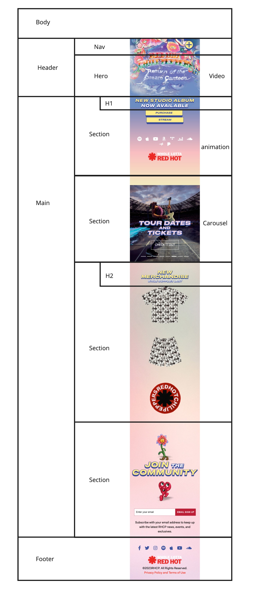
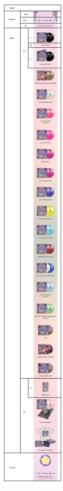
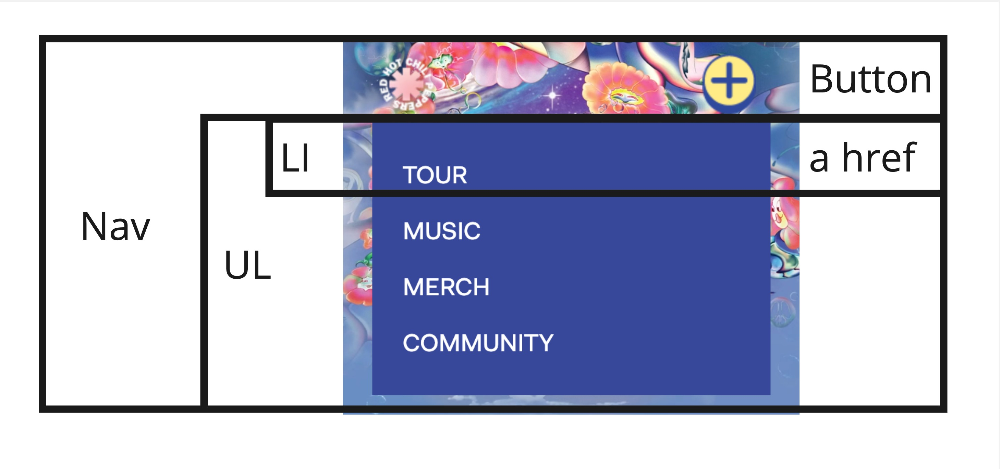
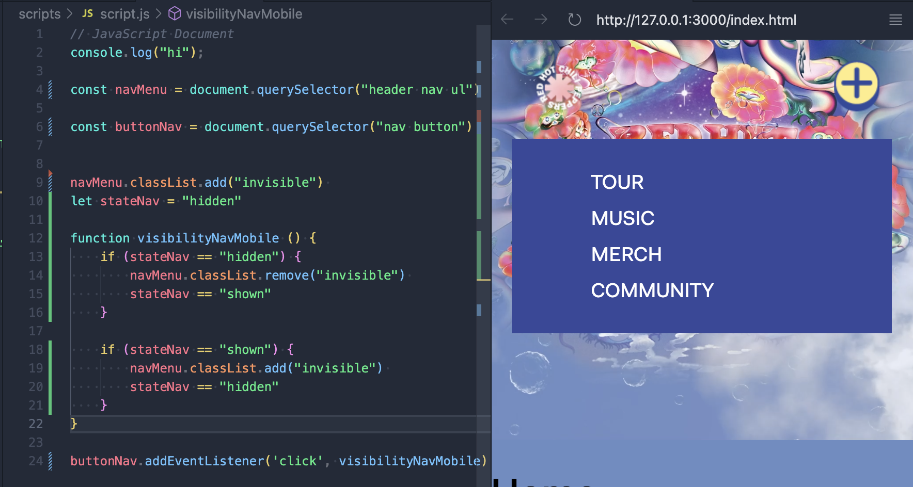
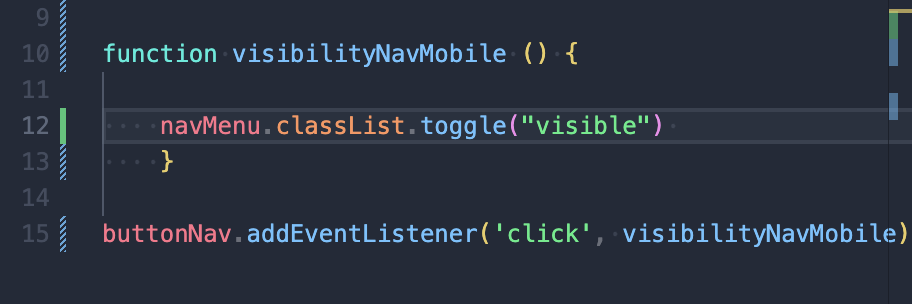
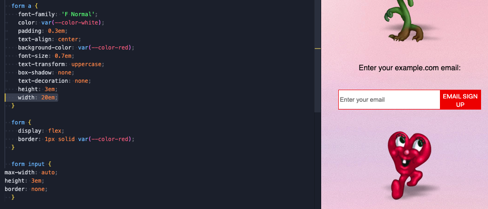
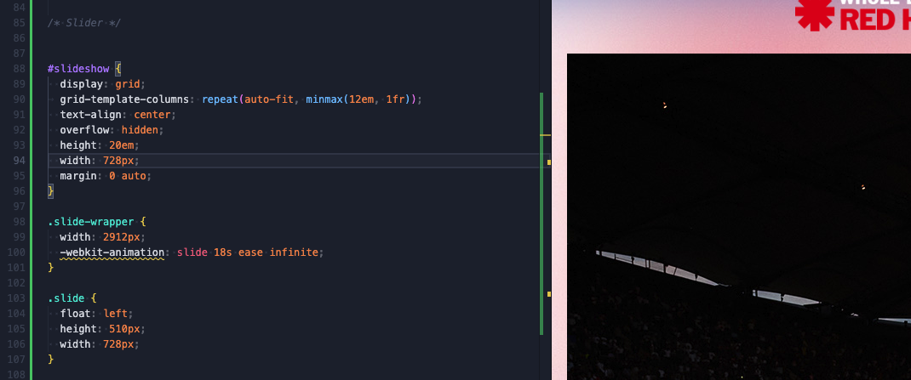
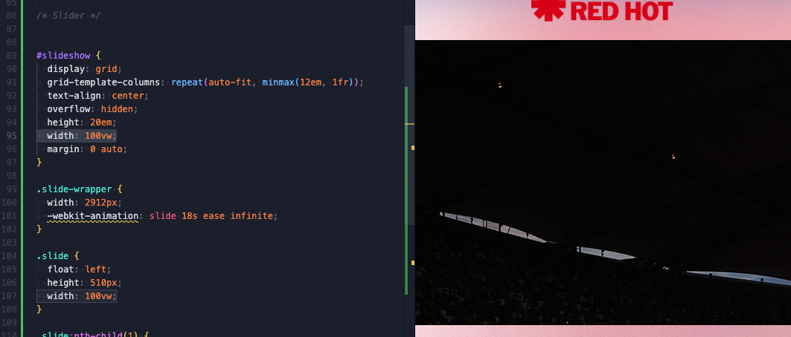

# Procesverslag
Markdown is een simpele manier om HTML te schrijven.  
Markdown cheat cheet: [Hulp bij het schrijven van Markdown](https://github.com/adam-p/markdown-here/wiki/Markdown-Cheatsheet).

Nb. De standaardstructuur en de spartaanse opmaak van de README.md zijn helemaal prima. Het gaat om de inhoud van je procesverslag. Besteedt de tijd voor pracht en praal aan je website.

Nb. Door *open* toe te voegen aan een *details* element kun je deze standaard open zetten. Fijn om dat steeds voor de relevante stuk(ken) te doen.

## Jij

  
uitwerken voor kick-off werkgroep

  ### Auteur:
  Sindy de Jong

  #### Je startniveau:
  Rode piste.

  #### Je focus:
  Ik wil mij graag focussen op responsive design. 
 

## Je website
uitwerken voor kick-off werkgroep

  
 Mobile 

  ### Je opdracht:
  <a href="https://redhotchilipeppers.com/"> Red Hot Chili Peppers website </a>

  #### Screenshot(s) van de eerste pagina (small screen): 
  Homepagina mobile (iPhone SE)
  

  #### Screenshot(s) van de tweede pagina (small screen):
  Muziek pagina mobile (iPhone SE)
  
 

  
 Desktop 

  ### Je opdracht:
  <a href="https://redhotchilipeppers.com/"> Red Hot Chili Peppers website </a>

  #### Screenshot(s) van de eerste pagina (large screen): 
  Homepagina desktop (Macbook air 13)
  

  #### Screenshot(s) van de tweede pagina (large screen):
  Muziek pagina desktop (Macbook Air 13)
  
 

## Toegankelijkheidstest 1/2 (week 1)

  
uitwerken na test in 2e werkgroep

  ### Bevindingen
  Lijst met je bevindingen die in de test naar voren kwamen:
  <ul>

  <li> Content: 
    <ul> 
    <li> Er wordt korte en duidelijke taal gebruikt. </li> 
    </ul>
  </li>
   
  <li> Global Code: 
    <ul> 
    <li> De HTML en CSS code is niet 100% valide. </li> 
    <li> Niet elke pagina heeft een unieke titel. </li> 
    </ul>
  </li>

  <li> Keyboard: 
    <ul> 
    <li> Niet elk element komt in focus style. Soms is de volgorde niet logisch. </li> 
    </ul>
  </li>

  <li> Mobile and touch: 
    <ul> 
    <li> Er is geen horizontal scrolling. </li> 
    <li> Buttons klein en weinig padding voor klikbaar veld. </li> 
    <li> Buttons geen hover state. </li> 
    <li> Dingen te dicht op elkaar om makkelijk te scrollen, zonder iets anders te hoveren.  </li> 
    </ul>
  </li>

  <li> Headings: 
    <ul> 
    <li> Soms zijn er twee soortgelijke elementen en is de linker wel met tekst en is de ander een plaatje van tekst. Dit is 
echt niet handig en toegangelijk. </li> 
    </ul>
  </li>

<li> Lists: 
    <ul> 
    <li> Voor de navigatie is er wel een list gebruikt. </li> 
    </ul>
  </li>

<li> Images: 
    <ul> 
    <li> Sommige plaatjes hebben een alt, maar deze beschrijft soms niet wat er in het plaatje te zien is. Zoals er staat "luister naar Return of the Dreem Canteen" in plaats van "Album cover van Return of the Dream Canteen"</li> 
    </ul>
  </li>

<li> Media (Video and Audio): 
    <ul> 
    <li> De header bestaat uit een video met animaties erin. Deze start automatisch en kan niet gepauzeerd worden. </li> 
    </ul>
  </li>

<li> Controls: 
    <ul> 
    <li> Niet alle linkjes zien er het zelfde uit of vallen op. </li> 
    <li> Je ziet niet wanneer een link in een  nieuw tabblad opent. </li>
     <li> De controls zoals knoppen hebben geen focusstates. </li>
        <li> Er is geen skip link aanwezig. </li>
    </ul>
  </li>

<li> Appearance: 
    <ul> 
    <li> Er is geen dark/light mode. Als ik mijn computer op dark-mode zet, veranderd er niks aan de website. </li> 
    <li> Niet alle tekst op de website is echt tekst, maar vaak ook een afbeelding van tekst. Hierdoor past niet alle tekst zich aan. </li> 
    </ul>
  </li>

<li> Animation: 
    <ul> 
    <li> De animatie in de header is een autoloop video. Andere animaties zijn nogal klein. Er is geen reduced-motion de vinden in de code. </li> 
    </ul>
  </li>

<li> Color contrast: 
    <ul> 
    <li> Het contrast van de tekst is vaak niet goed. De tekst is namelijk wit of geel gekleurd op een lichte achtergrond. </li> 
    </ul>
  </li>

  </ul>

## Breakdownschets (week 1)

  
uitwerken na afloop 3e werkgroep

  ### de hele homepagina: 
  

   ### de hele musicpagina: : 
  
  
  ### dynamisch deel (navigatie): 
  

 

## Voortgang 1 (week 2)

  
uitwerken voor 1e voortgang

  ### Stand van zaken
  hier dit ging goed & dit was lastig (neem ook screenshots op van delen van je website en code)

  
 Responsive grid voor images 

  #### Dit ging goed:
Hier lukte het wel om de navigatie te laten verschijnen, maar niet om de navigatie weer te verbergen. 
  

  ### Verslag van meeting
  hier na afloop snel de uitkomsten van de meeting vastleggen

  - Navigatie in de header doen
  - Bij img src geen . vergeten voor de /
  - Comments bij de code doen
  - Blijven documenteren

## Voortgang 2 (week 3)

  
uitwerken voor 2e voortgang

  ### Stand van zaken
  hier dit ging goed & dit was lastig (neem ook screenshots op van delen van je website en code)

  

  
 Navigatie button 

  #### Het probleem:
Hier lukte het wel om de navigatie te laten verschijnen, maar niet om de navigatie weer te verbergen. 
  

  #### De oplossing:
Een van de student assistenten hielp mij en zij gaf mij het advies om toggle te gebruiken. Nu werkt het wel.
  

   

  
 Form 

  #### Het probleem:
Hier lukte het niet om de breedte van de button aan te kunnen passen, zodat de volledige tekst op 1 regel komt te staan. Ookal geef ik hem een vaste waarde en staat van het input veld links op auto width.  
  

  #### De oplossing:
....
  
 

  ### Verslag van meeting
  hier na afloop snel de uitkomsten van de meeting vastleggen

  - Ik moet gaan doorwerken. 
  - Geen classes en id's gebruiken, maar selectoren. Behalve op grote secties in de main.
  - Documenteren is het belangrijkste.

## Toegankelijkheidstest 2/2 (week 4)

  
uitwerken na test in 9e werkgroep

  ### Bevindingen
  Lijst met je bevindingen die in de test naar voren kwamen (geef ook aan wat er verbeterd is):

## Voortgang 3 (week 4)

  
uitwerken voor 3e voortgang

  ### Stand van zaken
  hier dit ging goed & dit was lastig (neem ook screenshots op van delen van je website en code)

  
 Slider 

  #### Het probleem:
Hier heb ik de code van  <a href="https://codepen.io/gradar/pen/BaavLLo?editors=1100"> een codepen voorbeeld </a> gebruikt. De slider was breder dan de viewport en ik wilde dat hij in de breedte meeschaalt met de viewport width. 
  

  #### De oplossing:
Ik heb de code aangepast door de breedtes om te zetten in vw en daar ook de keyframes op aan te passen. 
  

  ### Agenda voor meeting
Vragen die ik heb:
  - Hoe maak ik de button in mijn form zo breed als ik wil?
  - goede css slider??
  - object-fit: op slider werkt niet?
  - h1: sr only

  ### Verslag van meeting
  hier na afloop snel de uitkomsten van de meeting vastleggen

  - hgroup ipv div
  https://developer.mozilla.org/en-US/docs/Web/HTML/Element/hgroup
  
  - h3 moet p zijn
  - secties een h -> sr only
  - alt in de img, niet in de a
  - icons in een ul

  - slider in een ul en li 
  - geen float in de slider
  - css flex carousel
  - text slider op vaste plek
  
  - tour pagina
  - detailpagina shirt

  - sr-only 
  https://css-tricks.com/inclusively-hidden/
  - reduced motion

  - alt text en title

## Veranderingen tov originele site

  
 Dit zijn aanpassing die ik heb gemaakt waarvan ik denk dat zij de site verbeteren. 

  - Altijd de 1 zichtbaar, ook op home. 
  - nav sticky. 
  - Alle h2 koppen wit, duidelijker te lezen. 
  - Alle h3 koppen geel en kleiner, want minder belangrijk maar door kleur vallen ze wel op. 
  - volgorde van plaatjes homepagina bij community sectie. 

  ### Je uitkomst - karakteristiek screenshots:
  

## Eindgesprek (week 5)

  
uitwerken voor eindgesprek

  ### Je uitkomst - karakteristiek screenshots:
  

  ### Dit ging goed/Heb ik geleerd: 
  Korte omschrijving met plaatjes

  

  ### Dit was lastig/Is niet gelukt:
Het is mij niet gelukt om te size knoppen bij de merch pagina van kleur te laten veranderen als erop geklikt is. 

  https://developer.mozilla.org/en-US/docs/Web/API/Document/getElementsByClassName 

  

## Bronnenlijst

  
continu bijhouden terwijl je werkt

  Nb. Wees specifiek ('css-tricks' als bron is bijv. niet specifiek genoeg). 
  Nb. ChatGpT en andere AI horen er ook bij.
  Nb. Vermeld de bronnen ook in je code.

  1. <a href="https://css-tricks.com/snippets/css/using-font-face-in-css/"> Bron van css-tricks voor @font-face </a>

  2. <a href="https://www.w3schools.com/howto/howto_js_toggle_class.asp"> Bron van w3schools voor toggle </a>

  3. <a href="https://stackoverflow.com/questions/15314407/how-to-add-button-inside-an-input"> Bron van Stackoverflow voor form </a>

  4. <a href="https://codepen.io/gradar/pen/BaavLLo?editors=1100"> Bron van Codepen voor CSS slider </a>

  https://www.w3schools.com/css/css3_mediaqueries_ex.asp 

