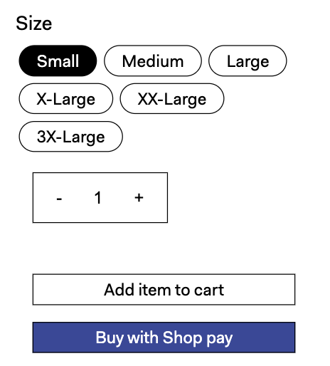
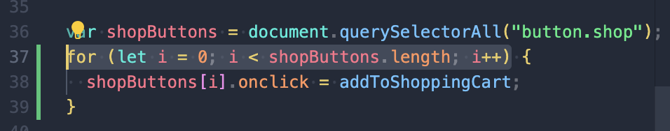
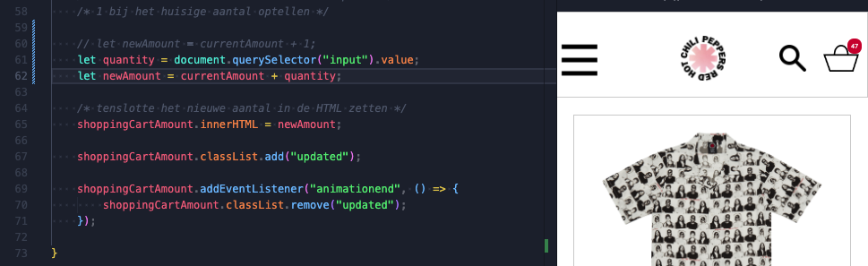

# Procesverslag
Markdown is een simpele manier om HTML te schrijven.  
Markdown cheat cheet: [Hulp bij het schrijven van Markdown](https://github.com/adam-p/markdown-here/wiki/Markdown-Cheatsheet).

Nb. De standaardstructuur en de spartaanse opmaak van de README.md zijn helemaal prima. Het gaat om de inhoud van je procesverslag. Besteedt de tijd voor pracht en praal aan je website.

Nb. Door *open* toe te voegen aan een *details* element kun je deze standaard open zetten. Fijn om dat steeds voor de relevante stuk(ken) te doen.

## Jij

  
uitwerken voor kick-off werkgroep

  ### Auteur:
  Sindy de Jong

  #### Je startniveau:
  Rode piste.

  #### Je focus:
  Ik wil mij graag focussen op responsive design. 
 

## Je website
uitwerken voor kick-off werkgroep

  
 Mobile 

  ### Je opdracht:
  <a href="https://redhotchilipeppers.com/"> Red Hot Chili Peppers website </a>

  #### Screenshot(s) van de eerste pagina (small screen): 
  Homepagina mobile (iPhone SE)
  

  #### Screenshot(s) van de tweede pagina (small screen):
  Tour pagina mobile (iPhone SE)
  

  #### Screenshot(s) van de tweede pagina (small screen):
  Merch pagina mobile (iPhone SE)
  
 

  
 Desktop 

  ### Je opdracht:
  <a href="https://redhotchilipeppers.com/"> Red Hot Chili Peppers website </a>

  #### Screenshot(s) van de eerste pagina (large screen): 
  Homepagina desktop (Macbook air 13)
  

  #### Screenshot(s) van de tweede pagina (large screen):
  Tour pagina desktop (Macbook Air 13)
  

   #### Screenshot(s) van de derde pagina (large screen):
  Merch pagina desktop (Macbook Air 13)
  
 

## Toegankelijkheidstest 1/2 (week 1)

  
uitwerken na test in 2e werkgroep

   <a href="https://acrobat.adobe.com/link/track?uri=urn:aaid:scds:US:44c6bfa6-065c-3e5b-8160-85bdd085d9b0"> Link naar pdf van test 1 </a>

  ### Bevindingen
  Lijst met je bevindingen die in de test naar voren kwamen:
  <ul>

  <li> Content: 
    <ul> 
    <li> Er wordt korte en duidelijke taal gebruikt. </li> 
    </ul>
  </li>
   
  <li> Global Code: 
    <ul> 
    <li> De HTML en CSS code is niet 100% valide. </li> 
    <li> Niet elke pagina heeft een unieke titel. </li> 
    </ul>
  </li>

  <li> Keyboard: 
    <ul> 
    <li> Niet elk element komt in focus style. Soms is de volgorde niet logisch. </li> 
    </ul>
  </li>

  <li> Mobile and touch: 
    <ul> 
    <li> Er is geen horizontal scrolling. </li> 
    <li> Buttons klein en weinig padding voor klikbaar veld. </li> 
    <li> Buttons geen hover state. </li> 
    <li> Dingen te dicht op elkaar om makkelijk te scrollen, zonder iets anders te hoveren.  </li> 
    </ul>
  </li>

  <li> Headings: 
    <ul> 
    <li> Soms zijn er twee soortgelijke elementen en is de linker wel met tekst en is de ander een plaatje van tekst. Dit is 
echt niet handig en toegangelijk. </li> 
    </ul>
  </li>

<li> Lists: 
    <ul> 
    <li> Voor de navigatie is er wel een list gebruikt. </li> 
    </ul>
  </li>

<li> Images: 
    <ul> 
    <li> Sommige plaatjes hebben een alt, maar deze beschrijft soms niet wat er in het plaatje te zien is. Zoals er staat "luister naar Return of the Dreem Canteen" in plaats van "Album cover van Return of the Dream Canteen"</li> 
    </ul>
  </li>

<li> Media (Video and Audio): 
    <ul> 
    <li> De header bestaat uit een video met animaties erin. Deze start automatisch en kan niet gepauzeerd worden. </li> 
    </ul>
  </li>

<li> Controls: 
    <ul> 
    <li> Niet alle linkjes zien er het zelfde uit of vallen op. </li> 
    <li> Je ziet niet wanneer een link in een  nieuw tabblad opent. </li>
     <li> De controls zoals knoppen hebben geen focusstates. </li>
        <li> Er is geen skip link aanwezig. </li>
    </ul>
  </li>

<li> Appearance: 
    <ul> 
    <li> Er is geen dark/light mode. Als ik mijn computer op dark-mode zet, veranderd er niks aan de website. </li> 
    <li> Niet alle tekst op de website is echt tekst, maar vaak ook een afbeelding van tekst. Hierdoor past niet alle tekst zich aan. </li> 
    </ul>
  </li>

<li> Animation: 
    <ul> 
    <li> De animatie in de header is een autoloop video. Andere animaties zijn nogal klein. Er is geen reduced-motion de vinden in de code. </li> 
    </ul>
  </li>

<li> Color contrast: 
    <ul> 
    <li> Het contrast van de tekst is vaak niet goed. De tekst is namelijk wit of geel gekleurd op een lichte achtergrond. </li> 
    </ul>
  </li>

  </ul>

## Breakdownschets (week 1)

  
uitwerken na afloop 3e werkgroep

  ### de hele homepagina: 
  

   ### de hele musicpagina: : 
  
  
  ### dynamisch deel (navigatie): 
  

 

## Voortgang 1 (week 2)

  
uitwerken voor 1e voortgang

  ### Stand van zaken
  hier dit ging goed & dit was lastig (neem ook screenshots op van delen van je website en code)

  
 Responsive grid voor images 

  #### Dit ging goed:
Hier lukte het wel om de navigatie te laten verschijnen, maar niet om de navigatie weer te verbergen. 
  

  ### Verslag van meeting
  hier na afloop snel de uitkomsten van de meeting vastleggen

  - Navigatie in de header doen
  - Bij img src geen . vergeten voor de /
  - Comments bij de code doen
  - Blijven documenteren

## Voortgang 2 (week 3)

  
uitwerken voor 2e voortgang

  ### Stand van zaken
  hier dit ging goed & dit was lastig (neem ook screenshots op van delen van je website en code)

  

  
 Navigatie button 

  #### Het probleem:
Hier lukte het wel om de navigatie te laten verschijnen, maar niet om de navigatie weer te verbergen. 
  

  #### De oplossing:
Een van de student assistenten hielp mij en zij gaf mij het advies om toggle te gebruiken. Nu werkt het wel.
  

   

  
 Form 

  #### Het probleem:
Hier lukte het niet om de breedte van de button aan te kunnen passen, zodat de volledige tekst op 1 regel komt te staan. Ookal geef ik hem een vaste waarde en staat van het input veld links op auto width.  
  

  #### De oplossing:
....
  
 

  ### Verslag van meeting
  hier na afloop snel de uitkomsten van de meeting vastleggen

  - Ik moet gaan doorwerken. 
  - Geen classes en id's gebruiken, maar selectoren. Behalve op grote secties in de main.
  - Documenteren is het belangrijkste.

## Toegankelijkheidstest 2/2 (week 4)

  
uitwerken na test in 9e werkgroep

  <a href="https://acrobat.adobe.com/link/track?uri=urn:aaid:scds:US:69d08e67-734b-329a-ac99-d41b2b177be0"> Link naar pdf van test 2 </a>

  ### Bevindingen
  Lijst met je bevindingen die in de test naar voren kwamen (geef ook aan wat er verbeterd is):
  

  <ul>

  <li> Content: 
    <ul> 
    <li> Er wordt korte en duidelijke taal gebruikt. </li> 
    <li> alle buttons hebben een titel gekregen. Ook alle afbeeldingen met een a die dienen als knoppen hebben een titel. Formulieren hebben een label en alle afbeeldingen hebben een alt. Elke link wordt  beschreven met een alt. </li>
    </ul>
  </li>
   
  <li> Global Code: 
    <ul> 
    <li> Alle HTML en CSS is errorloos.. </li> 
    <li> Elke pagina heeft een titel en als deze niet wordt weergeven dan zit er de class sr-only op.   </li> 
    </ul>
  </li>

  <li> Keyboard: 
    <ul> 
    <li> Elk element komt in focus met tab en ook de volgorde klopt met de layout. </li> 
    </ul>
  </li>

  <li> Mobile and touch: 
    <ul> 
    <li> Buttons heb ik groter gemaakt.  </li> 
    <li> Ook heb ik een hover state toegevoegd.Buttons</li> 
    <li> Buttons geen hover state. </li> 
    <li> Daarnaast heb ik de margins tussen elementen aanpast, er zit nu meer ruimte tussen.  </li> 
    </ul>
  </li>

  <li> Headings: 
    <ul> 
    <li> Soms zijn er twee soortgelijke elementen en is de linker wel met tekst en is de ander een plaatje van tekst. Dit is 
echt niet handig en toegangelijk. </li> 
    </ul>
  </li>

<li> Lists: 
    <ul> 
    <li> Voor elke opeenvolging van afbeeldingen en items is een ul gebruikt.  </li>
    <li> Ook voor elementen zoals een slider en de navigatie.    </li> 
    </ul>
  </li>

<li> Images: 
    <ul> 
    <li> Alle afbeeldingen hebben of een title of een alt, afhankelijk van hun functie.</li> 
    <li> Daarnaast hebben decoratieve afbeeldingen een lege alt.</li> 
      <li> Ook heb ik met de alt text de actie beschreven in plaats van alleen het plaatje. </li> 
    </ul>
  </li>

<li> Media (Video and Audio): 
    <ul> 
    <li> Dde header bestaat uit een video met animaties erin. Deze is niet op pauze te zetten, maar wordt wel vervangen door een afbeelding als de gebruiker reduces motion aan heeft staan. </li> 
    </ul>
  </li>

<li> Controls: 
    <ul> 
    <li> Alles wat ene link is ziet er hetzelfde uit en valt op </li> 
    <li> Elke link heeft een hover state </li>
     <li> Er is gedacht aan de focusstates </li>
    </ul>
  </li>

<li> Appearance: 
    <ul> 
    <li>Op de originele site is bijna alle tekst een afbeelding. Ik heb dit aangepast door hier wel tekst voor de gebruiken. Hierdoor schaalt alle tekst nu wel mee.  </li> 
    </ul>
  </li>

<li> Animation: 
    <ul> 
    <li> de animatie in de header is een autoloop video. Deze is niet te pauzeren, maar wordt wel vervangen door een afbeelding bij reduced motion.  </li> 
    <li> Verder zijn de animaties subtiel en ook die gaan allemaal uit als reduced motion aan staat.  </li> 
    </ul>
  </li>

<li> Color contrast: 
    <ul> 
    <li> Het contrast van de tekst is groter gemaakt. Ook heb ik consistentie toegepast. </li> 
    </ul>
  </li>

  </ul>

## Voortgang 3 (week 4)

  
uitwerken voor 3e voortgang

  ### Stand van zaken
  hier dit ging goed & dit was lastig (neem ook screenshots op van delen van je website en code)

  
 Slider 

  #### Het probleem:
Hier heb ik de code van  <a href="https://codepen.io/gradar/pen/BaavLLo?editors=1100"> een codepen voorbeeld </a> gebruikt. De slider was breder dan de viewport en ik wilde dat hij in de breedte meeschaalt met de viewport width. 
  

  #### De oplossing:
Ik heb de code aangepast door de breedtes om te zetten in vw en daar ook de keyframes op aan te passen. 
  

  ### Agenda voor meeting
Vragen die ik heb:
  - Hoe maak ik de button in mijn form zo breed als ik wil?
  - goede css slider??
  - object-fit: op slider werkt niet?
  - h1: sr only

  ### Verslag van meeting
  hier na afloop snel de uitkomsten van de meeting vastleggen

  - hgroup ipv div
    <a href="  https://developer.mozilla.org/en-US/docs/Web/HTML/Element/hgroup"> Bron van Mozilla voor hgroup </a>
  
  - h3 moet p zijn
  - secties een h -> sr only
  - alt in de img, niet in de a
  - icons in een ul

  ## slider

  - css flex carousel
  - slider in een ul en li 
  - text slider op vaste plek
  - geen float in de slider
  

  
 geen float 

  #### De oplossing:
Ik heb van de ul een flexbox gemaakt en bij de li left op 0 gezet. 
  

## nog maken
  - tour pagina
  - detailpagina shirt

## toegankelijkheid 
  - sr-only:
  <a href="https://css-tricks.com/inclusively-hidden/"> Bron van CSStricks voor inclusively hidden </a>
  - reduced motion
  - alt text en title

## Veranderingen tov originele site

  
 Dit zijn aanpassing die ik heb gemaakt waarvan ik denk dat zij de site verbeteren. 

  - Alle h2 koppen wit, duidelijker te lezen. 
  - Alle h3 koppen geel en kleiner, want minder belangrijk maar door kleur vallen ze wel op. 
  - tekst gebruikt in plaats van plaatjes 
  - volgorde van plaatjes homepagina bij community sectie. 
  - meer ruimte tussen de secties
  - extra animaties toegevoegd.
  - reduced motion
  - titles bij buttons en plaatjes

  ### Je uitkomst - karakteristiek screenshots:
  

## Eindgesprek (week 5)

  
uitwerken voor eindgesprek

  ### Je uitkomst - karakteristiek screenshots:
  
  

  
  

  
  

  ### Dit ging goed/Heb ik geleerd: 
Het is mij gelukt om een slider te maken met enkel css. De code hiervoor is erg simpel, ik heb feedback opgevolgd en enkel ul en li gebruikt. Eerst werd er nog float gebruikt, maar dit heb ik vervangen door flexbox te gebruiken. Het duurde wel een tijd voordat het mij gelukt was. Ik ben veel voorbeelden op internet afgegaan en daarom ben ik extra blij dat het toch is gelukt. 

  

  Ook ben ik erg trots dat het mij is geleukt om alle pagina's responsive te maken. In het begin vond ik dit erg lastig, maar met veel uitproberen en vragen stellen ben ik er uiteindelijk toch gekomen. Grid en flexbox weten te gebruiken heeft mij erg geholpen en dit zal ik ook in de toekomst altijd gaan toepassen. 

  ### Dit was lastig/Is niet gelukt:

Het is mij niet gelukt om de winkelmand een interactieve animatie te geven. Ik heb de code gebruikt van DLO (bron 9), maar ik heb geen idee waarom het niet werkt. 

  
  
  Hieronder is mijn HTML en JS code te zien. 
  

Het is mij niet gelukt om te size knoppen bij de merch pagina van kleur te laten veranderen als erop geklikt is. Ik wilde dit doen door met javascript een class te togglen. 
  

  Hieronder is mijn HTML en JS code te zien. 
    

  ## Feedback
  - Meer custom properties gebruiken
  - Tweede toegankeijkheidstest uitwerken. 
  - HTML error-loos
  - CSS error-loos

## Verbeteringen na eindgesprek 

  
 Aanpassingen na eindgesprek 

  ## Homepagina
  - Bij hgroup moet de a in een p staan
  - alt="" bij afbeedingen die voor de sier zijn. 

  ## Tourpagina
  - Niet alles was doorheen te tabben. Dit heb ik opgelost door tabindex toe te voegen aan de h2 en hgroup. Nu is alles tab-baar. 
   

  ## Merchpagina
  - De verhoudingen van de afbeelding zijn niet correct responsive bij een breedte tussen de 375px en 1024px in. 
Dit heb ik aangepast door een extra media query toe te voegen voor tussen de 460px en 1024px waarin de breedte van de grid column is aangepast. Nu schaalt hij goed mee. 
    

  - De winkelmand animatie lukte eerst niet, dit heb ik kort voor het gesprekje nog aangepast. 
  Hieronder is een screenshot van mijn code te zien. Er miste 1 regel in mijn JS. 
     

   - Aantal items dat toegevoegd wordt aan winkelmand laten bepalen met de input van de quantity selector.
   Eerst lukte dit niet. De getallen werden achterelkaar gezet als een reeks in plaats van bij elkaar opgeteld. 
    

  Na gegoogled te hebben (bron 12) kwam ik erachter dat er parseInt voor de waardes moet, zodat js ze bij elkaar opteld. 
    Na dit gedaan te hebben, werkte het!
    

   - Quantity selector laten werken met de buttons ernaast. Na wat gepriegel in javascript is het mij gelukt. 
    

  ## Algemeen
  - Meer custom properties gebruikt
  - Tweede toegankeijkheidstest uitgewerkt. 
  - HTML error-loos
  - CSS error-loos

## Bronnenlijst

  
continu bijhouden terwijl je werkt

  Nb. Wees specifiek ('css-tricks' als bron is bijv. niet specifiek genoeg). 
  Nb. ChatGpT en andere AI horen er ook bij.
  Nb. Vermeld de bronnen ook in je code.

  1. <a href="https://css-tricks.com/snippets/css/using-font-face-in-css/"> Bron van css-tricks voor @font-face </a>

  2. <a href="https://www.w3schools.com/howto/howto_js_toggle_class.asp"> Bron van w3schools voor toggle </a>

  3. <a href="https://stackoverflow.com/questions/15314407/how-to-add-button-inside-an-input"> Bron van Stackoverflow voor form </a>

  4. <a href="https://codepen.io/gradar/pen/BaavLLo?editors=1100"> Bron van Codepen voor CSS slider </a>

5. <a href="https://css-tricks.com/inclusively-hidden/"> Bron van CSS-tricks voor inclusively hidden </a>

6. <a href="https://www.w3schools.com/css/css3_mediaqueries_ex.asp"> Bron van W3schools voor media queries </a>

7. <a href="https://codepen.io/ChynoDeluxe/pen/poyNEay"> Bron van Codepen voor een quantity selector </a>

8. <a href="https://developer.mozilla.org/en-US/docs/Web/CSS/@media/prefers-reduced-motion"> Bron van Mozilla voor reduced motion </a>

9. <a href="https://codepen.io/shooft/pen/rNdqQdO"> Bron van DLO voor shopping cart animatie</a>

10. <a href="https://developer.mozilla.org/en-US/docs/Web/API/Document/getElementsByClassName"> Bron van Mozilla voor JS class selector </a>

11. <a href="https://web.dev/learn/html/focus#:~:text=The%20convention%20for%20non%2Dtabbable,set%20focus%20to%20focusable%20elements."> Bron van Web.dev voor tabindex </a>

11. <a href="https://www.tutorialspoint.com/Are-both-addition-and-concatenation-same-in-JavaScript#:~:text=We%20can%20also%20apply%20the,it%20performs%20the%20simple%20addition."> Bron van Tutorialspont voor parseInt </a>

